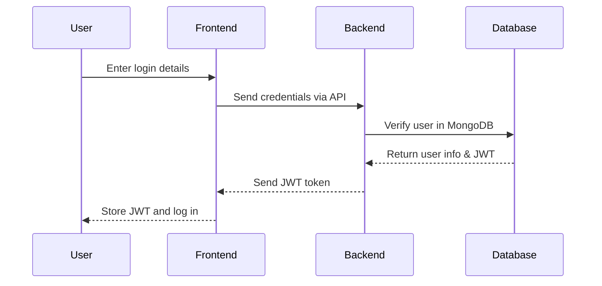

🛒 Mini-Shop (MERN Stack)

📌 Project Overview

Mini-Shop is a full-stack e-commerce application built using React (Frontend), Express.js (Backend), and MongoDB (Database). It provides essential shopping functionalities such as product listing, cart management, checkout, and authentication.

📊 Architecture Diagram
```mermaid
graph TD;

  A[Frontend (React)] -->|Home Page| B[List of Products];
  A -->|Product Page| C[Product Details];
  A -->|Cart Page| D[Shopping Cart];
  A -->|Checkout Page| E[Order Confirmation];
  A -->|Login/Register Page| F[User Authentication];
  A -->|Navbar| G[Navigation Bar];

  H[Backend (Express + MongoDB)] -->|User Authentication| I[JWT Login/Register];
  H -->|Product Management| J[Store Product Details];
  H -->|Cart Functionality| K[Manage User Carts];
  H -->|Order Management| L[User Orders];

  M[Other Features] -->|Protected Routes| N[Restrict Access];
  M -->|Session Persistence| O[Keep Users Logged In];
  M -->|Basic UI Styling| P[CSS/Bootstrap];
```

🚀 Features

Frontend (React)

✅ Home Page – Displays a list of products✅ Product Page – Shows details of a selected product✅ Cart Page – Users can add/remove items in their cart✅ Checkout Page – Simple order confirmation (without payments)✅ Login/Register Page – Users can sign up and log in✅ Navbar – Shows login/logout buttons and user status

Backend (Express + MongoDB)

✅ User Authentication – Login/Register with JWT (JSON Web Token)✅ Product Management – Store product details (name, price, image, description)✅ Cart Functionality – Allow adding/removing items (stored per user)✅ Order Management – Store user orders (history of purchases)

Other Features

✅ Protected Routes – Users must be logged in to checkout✅ Session Persistence – Keep users logged in using JWT stored in localStorage✅ Basic UI Styling – Using regular CSS or Bootstrap

🔑 Authentication Flow

⚙️ Installation & Setup

1. Clone the Repository
```sh
git clone https://github.com/your-username/mini-shop.git
cd mini-shop
```
2. Install Dependencies

Frontend
```sh
cd frontend
npm install
```
Backend
```sh
cd backend
npm install
```
3. Configure Environment Variables

Create a .env file in the backend directory and add:
```sh
MONGO_URI=your_mongodb_connection_string
JWT_SECRET=your_jwt_secret
```
4. Run the Application

Start Backend
```sh
cd backend
npm start
```
Start Frontend
```sh
cd frontend
npm start
```
🛠️ Tech Stack

Frontend: React, React Router, Axios, Bootstrap

Backend: Node.js, Express.js, MongoDB, JWT Authentication

Database: MongoDB (Mongoose ODM)

Other Tools: Git, Postman, Dotenv

📜 License

This project is open-source and available under the MIT License.

📞 Contact

For questions or contributions, contact [Your Name] at [your-email@example.com].

Happy Coding! 🚀

